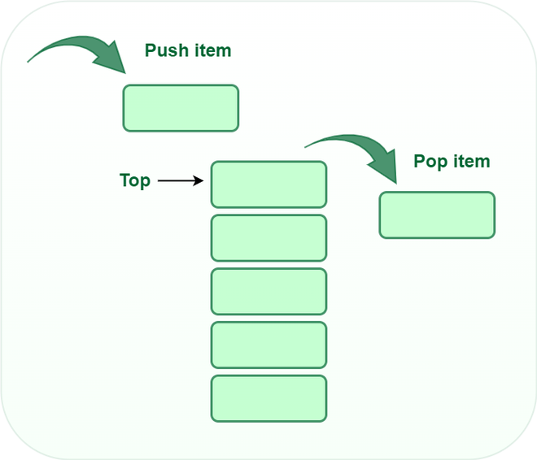

# Stack

A stack is a linear data structure in which the insertion of a new element and removal of an existing element takes place at the same end represented as the top of the stack.

A stack can be implemented using an array or a linked list.

## Basic Operations on Stack
In order to make manipulations in a stack, there are certain operations provided to us.

*   push() to insert an element into the stack.

*   pop() to remove an element from the stack

*   top() Returns the top element of the stack.

*   isEmpty() returns true if stack is empty else false.
*   size() returns the size of stack.



## Time complexity


*   push() 	O(1)
*   size()	O(1)
*   pop()   	O(1)
*   isEmpty() 	O(1)
*   size()	O(1)

## Pseudocode


```
# Initialize an empty stack
stack = createStack()

# Check if the stack is empty
if isEmpty(stack):
    # Print that the stack is empty

# Push an item onto the stack
push(stack, item)

# Pop an item from the stack
popped_item = pop(stack)

# Check if the stack is empty
if isEmpty(stack):
    # Print that the stack is empty

# Peek at the top item of the stack without removing it
top_item = peek(stack)

```


## Pattern