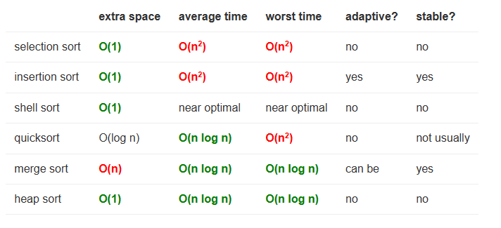

# Time Complexity
Here's a brief overview of common time complexities encountered in algorithms:

1. **O(1) - Constant Time:**
   - The algorithm's runtime is constant, regardless of the size of the input. Operations like accessing an element in an array or performing basic arithmetic fall into this category.

2. **O(log n) - Logarithmic Time:**
   - Commonly associated with algorithms that divide the problem into smaller subproblems, reducing the search space in each step. Binary search is an example.

3. **O(n) - Linear Time:**
   - The runtime grows linearly with the size of the input. Operations that involve iterating through each element in the input, like a sequential search, have linear time complexity.

4. **O(n log n) - Linearithmic Time:**
   - Often seen in algorithms that divide the problem and then combine the results. Efficient sorting algorithms like merge sort and heap sort fall into this category.

5. **O(n^2) - Quadratic Time:**
   - The runtime is proportional to the square of the size of the input. Common in algorithms with nested iterations, such as some sorting algorithms (e.g., bubble sort).

6. **O(n^k) - Polynomial Time:**
   - General representation for algorithms with nested iterations where the number of nested iterations is constant (k). Algorithms with cubic time complexity (O(n^3)), quartic time complexity (O(n^4)), etc., fall into this category.

7. **O(2^n) - Exponential Time:**
   - The runtime grows exponentially with the size of the input. Algorithms with recursive branching, such as the naive recursive implementation of the Fibonacci sequence, often have exponential time complexity.

8. **O(n!) - Factorial Time:**
   - The runtime grows factorially with the size of the input. This is usually associated with algorithms that generate all possible permutations or combinations of a set.

9. **O(n^n) - Exponential Time:**
   - Similar to O(2^n), but with a higher base. Algorithms with nested exponential iterations fall into this category.

It's important to note that these are asymptotic notations, describing how the runtime of an algorithm scales with input size in the worst-case scenario. Additionally, Big-O notation provides an upper bound on the growth rate of the algorithm's runtime. In practice, constants and lower-order terms may also influence the actual performance.

An **adaptive sort** is one that performs better on partially sorted inputs, and takes O(n) time on sorted or almost-sorted inputs.

A **stable sort** is one that preserves the relative ordering of elements that compare as equal.

# Time and space complexity

# Time Complexity
Here's a table outlining the time and space complexities for basic operations of popular data structures:

| Data Structure | Operation               | Best Case Complexity | Average Case Complexity | Worst Case Complexity | Space Complexity |
|----------------|-------------------------|----------------------|-------------------------|------------------------|------------------|
| Array          | Access by Index         | O(1)                 | O(1)                    | O(1)                   | O(n)             |
|                | Modify by Index         | O(1)                 | O(1)                    | O(1)                   |                  |
|                | Insertion (Dynamic)     | O(1) [amortized]     | O(1) [amortized]        | O(n) [amortized]       |                  |
|                | Deletion by Index       | O(n)                 | O(n)                    | O(n)                   |                  |
| Linked List    | Insertion at Head       | O(1)                 | O(1)                    | O(1)                   | O(n)             |
|                | Insertion at Tail       | O(1)                 | O(1)                    | O(1)                   |                  |
|                | Insertion at Position   | O(1) or O(n)         | O(n)                    | O(n)                   |                  |
|                | Deletion at Head        | O(1)                 | O(1)                    | O(1)                   |                  |
|                | Deletion at Tail        | O(n)                 | O(n)                    | O(n)                   |                  |
|                | Deletion at Position    | O(1) or O(n)         | O(n)                    | O(n)                   |                  |
| Stack          | Push                    | O(1)                 | O(1)                    | O(1)                   | O(n)             |
|                | Pop                     | O(1)                 | O(1)                    | O(1)                   |                  |
| Queue          | Enqueue                 | O(1)                 | O(1)                    | O(1)                   | O(n)             |
|                | Dequeue                 | O(1)                 | O(1)                    | O(1)                   |                  |
| Hash Table     | Insertion               | O(1)                 | O(1)                    | O(n)                   | O(n)             |
|                | Deletion                | O(1)                 | O(1)                    | O(n)                   |                  |
|                | Searching               | O(1)                 | O(1)                    | O(n)                   |                  |
|                | Accessing               | O(1)                 | O(1)                    | O(n)                   |                  |
| Binary Tree    | Insertion               | O(1)                 | O(log n)                | O(n)                   | O(n)             |
|                | Deletion                | O(log n)             | O(log n)                | O(n)                   |                  |
|                | Searching               | O(1)                 | O(log n)                | O(n)                   |                  |
|                | Depth-First Traversal   | O(n)                 | O(n)                    | O(n)                   |                  |
|                | Breadth-First Traversal | O(n)                 | O(n)                    | O(n)                   |                  |

These complexities are generalized and may vary depending on the specific implementation and environmental factors.